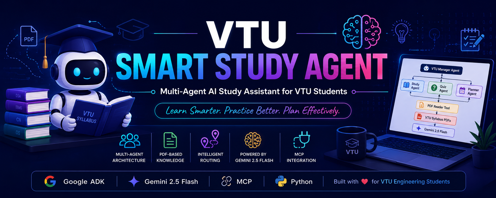
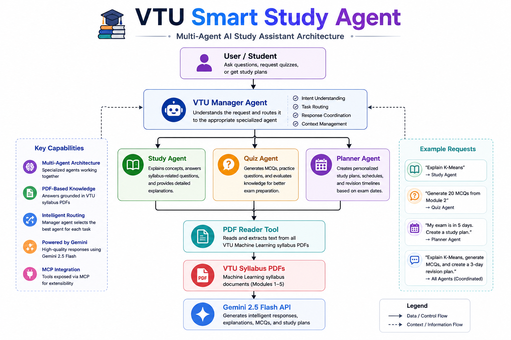

<p align="center">
  
</p>

# 🎓 VTU Smart Study Agent

> **A Multi-Agent AI Study Assistant built using Google ADK, Gemini 2.5 Flash, MCP, and PDF-based knowledge retrieval for VTU Engineering students.**

<p align="center">


</p>

---

# 📖 Overview

VTU Smart Study Agent is an intelligent multi-agent learning assistant designed to help engineering students prepare for examinations more efficiently.

The system uses **Google Agent Development Kit (ADK)** to coordinate multiple specialized AI agents that collaborate to answer questions, generate quizzes, and create personalized study plans using VTU syllabus PDFs.

---

# ✨ Features

* 🤖 Multi-Agent Architecture
* 📚 Study Agent
* ❓ Quiz Agent
* 📅 Planner Agent
* 📄 PDF-based syllabus reader
* 🔌 MCP Integration
* ⚡ Gemini 2.5 Flash
* 🧩 Modular and scalable architecture

---

# 🏗️ Architecture

<p align="center">
  
</p>

---

# 🤖 Agents

## 🧠 Manager Agent

* Routes requests to the appropriate specialist agent.
* Coordinates communication between sub-agents.

### 📚 Study Agent

* Explains VTU syllabus concepts
* Answers theory questions
* Uses syllabus PDFs as its knowledge source

### ❓ Quiz Agent

* Generates MCQs
* Helps with revision
* Tests conceptual understanding

### 📅 Planner Agent

* Creates personalized study schedules
* Builds revision plans
* Organizes preparation based on available time

---

# 🛠️ Tech Stack

* Python 3.10
* Google Agent Development Kit (ADK)
* Gemini 2.5 Flash
* FastMCP
* PyPDF
* python-dotenv

---

# 📂 Project Structure

```text
vtu-smart-study-agent/
│
├── assets/
│   ├── banner.png
│   └── architecture.png
│
├── study_agent/
│   ├── agent.py
│   ├── sub_agents/
│   ├── tools/
│   ├── mcp/
│   └── data/
│
├── tests/
├── README.md
├── requirements.txt
├── CONTRIBUTING.md
└── LICENSE
```

---

# ⚙️ Installation

```bash
git clone <repository-url>

cd vtu-smart-study-agent

python -m venv .venv
```

### Windows

```bash
.venv\Scripts\activate
```

Install dependencies:

```bash
pip install -r requirements.txt
```

Create a `.env` file:

```env
GOOGLE_API_KEY=YOUR_API_KEY
```

Run the application:

```bash
adk web
```

---

# 💬 Example Prompts

```text
Explain supervised learning.
```

```text
Generate 10 MCQs from Module 2.
```

```text
My exam is in 5 days. Create a study plan.
```

```text
Explain K-Means, generate 10 MCQs, and create a 3-day revision plan.
```

---

# 📸 Demo

Demo screenshots and a walkthrough GIF will be added here.

---

# 🎯 Concepts Demonstrated

* ✅ Multi-Agent Systems
* ✅ Google ADK
* ✅ Tool Calling
* ✅ MCP Integration
* ✅ Modular Agent Design
* ✅ Gemini API Integration

---

# 🚀 Future Improvements

* Persistent Memory
* Vector Database (RAG)
* Previous Year Question Paper Analysis
* Voice Assistant
* Progress Tracking Dashboard
* Mobile Application

---

# 👨‍💻 Author

**Yesh(itsyesh)**

AI & Machine Learning Engineering Student

🌐 Portfolio: **https://itsyesh.in**
